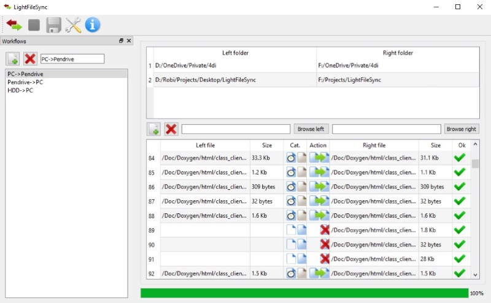

Light File Sync
===============
Its a lightweight and fast file synchronization software written in C++. Minimum requirements: a PC with Windows7 x64 OS. No installer, no virus or malware, its totally free.

Download source code
--------------------
Get the source code: <a target="_blank" href="https://github.com/4dillusions/LightFileSync/archive/master.zip"><b>LightFileSync source code</b></a>

Depencies
---------
<ul>
<li><b>QT</b> UI library</li>
<li><b>VC141 CRT</b> VC++ redist</li>
<li><b>MS winCRT</b> Windows Kits</li>
</ul>

Compile
-------
<b>Windows x64</b> Open Solution file: Solution\Windows\LightFileSync.sln
